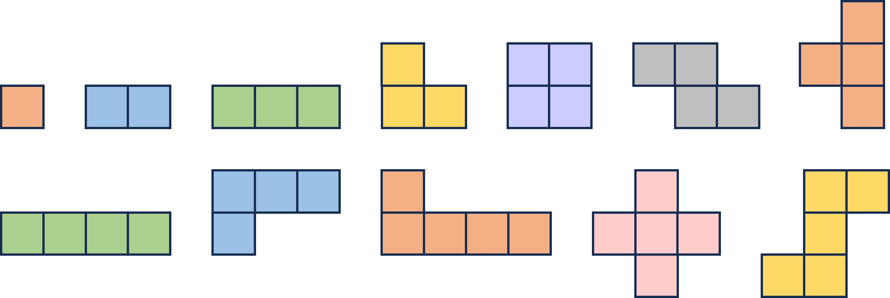
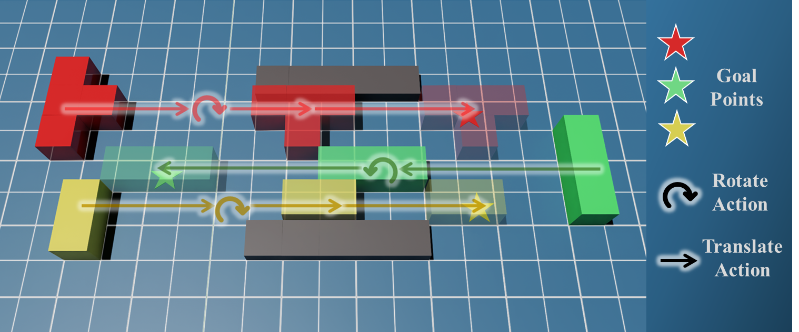

# AnyGeometry-CBS

**Any Geometry Conflict-Based Search for Multi-Agent Path Finding**

## About

AG-CBS is a framework designed for Multi-Agent Path Finding (MAPF) with arbitrary shapes. Unlike traditional single grid-based or point-agent methods, AG-CBS handles complex geometries to ensure collision-free paths in more realistic environments.

This implementation is based on the algorithm presented in our ICRA 2026 paper.

### Shape Examples

AG-CBS supports arbitrary agent shapes. Below are some examples:



### Planning Example



## Dependencies

- C++ 17 or higher
- CMake >= 3.10
- Eigen3
- Boost (program_options)
- yaml-cpp

## Build Instructions

```bash
# 1. Clone the repository
git clone https://github.com/NKU-MobFly-Robotics/AnyGeometry-CBS.git
cd AnyGeometry-CBS

# 2. Build with CMake
cd src/any_geometry_cbs
mkdir build && cd build
cmake ..
make -j$(nproc)
```

## Usage

You can test the planners using the provided map files in `src/maps/`.

### Running AG-CBS (optimal):

```bash
cd build/
./AG_CBS -i ../src/maps/warehouse_agent6_1.yaml -o ../src/output/result_cbs.yaml
```

### Running AG-ECBS (suboptimal, faster):

```bash
cd build/
./AG_ECBS -i ../src/maps/warehouse_agent6_1.yaml -o ../src/output/result_ecbs.yaml -w 1.25
```

### Command-line Options

| Option | Description | Default |
|--------|-------------|---------|
| `-h, --help` | Show help message | |
| `-i, --input` | Input YAML file | `../src/maps/warehouse_agent6_1.yaml` |
| `-o, --output` | Output YAML file | `./output.yaml` |
| `-w, --weight` | Sub-optimality weight (ECBS only) | `1.25` |
| `--disappear-at-goal` | Agents disappear at goal instead of staying | `false` |

### Output Format

The output YAML file contains:

```yaml
statistics:
  cost: <total cost>
  makespan: <makespan>
  runtime: <runtime in seconds>
  highLevelExpanded: <high-level nodes expanded>
  lowLevelExpanded: <low-level nodes expanded>
schedule:
  agent0:
    - x: <x>
      y: <y>
      o: <orientation>
      t: <time>
  agent1:
    ...
```

## Input Format

Example input YAML file:

```yaml
map:
  dimensions: [width, height]
  obstacles:
    - [x1, y1]
    - [x2, y2]
    ...

agents:
  - name: agent0
    start: [x, y]
    goal: [x, y]
    shape:
      - [dx1, dy1]
      - [dx2, dy2]
      ...
```

The `shape` field defines the agent's geometry relative to its center position.

## Citation

The paper *"AnyGeometry-CBS: Any Geometry Conflict-Based Search for Multi-Agent Path Finding"* has been accepted by **IEEE ICRA 2026**. Citation information will be added once the paper is available online.

## Acknowledgments

This implementation incorporates and extends parts of the [libMultiRobotPlanning](https://github.com/whoenig/libMultiRobotPlanning) library. We thank the original authors for their contributions to the MAPF community.

## License

This project is licensed under the MIT License - see the [LICENSE](../../LICENSE) file for details.
